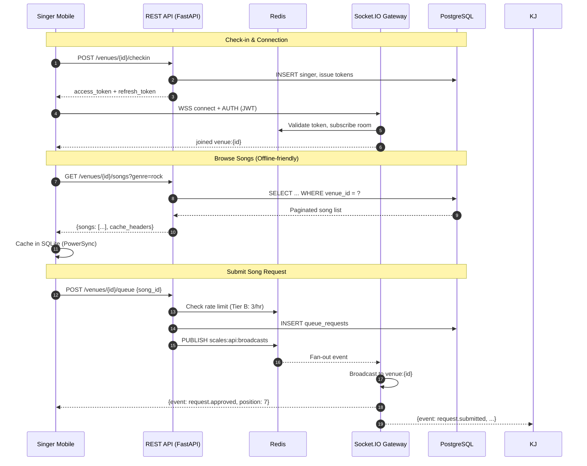
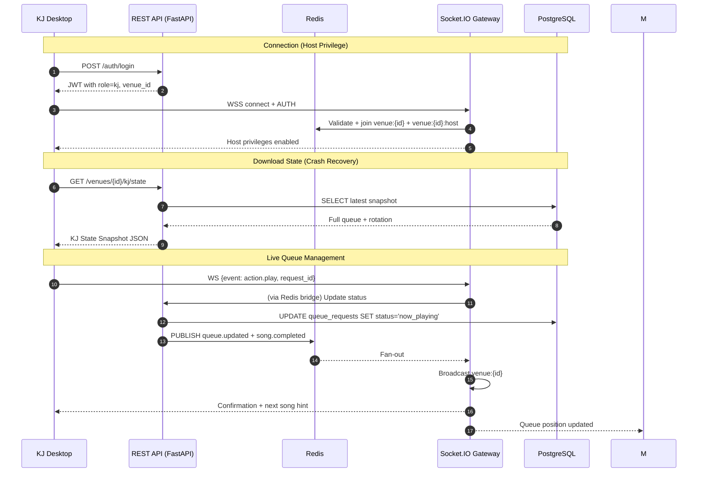
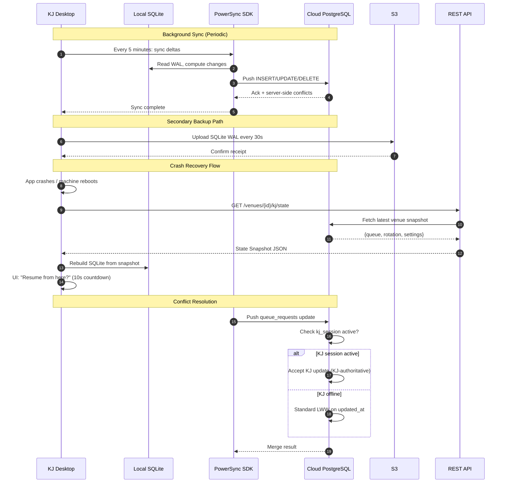
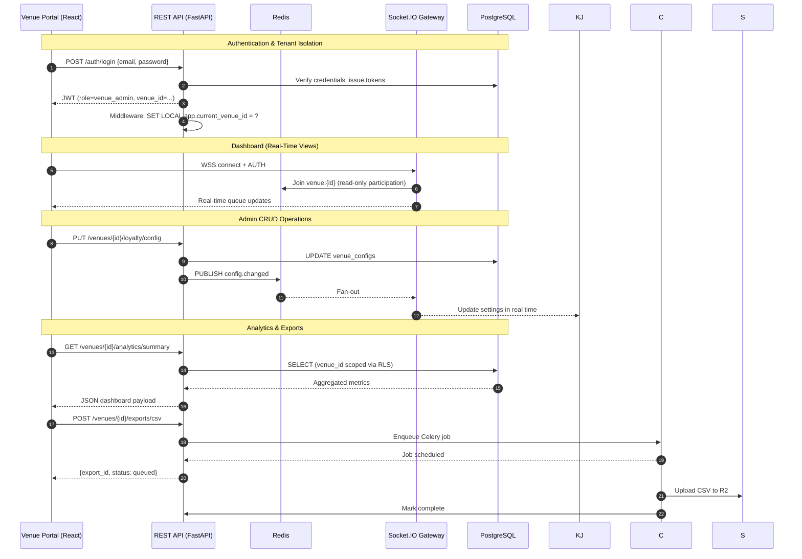

# Scales Karaoke Platform — Component Interaction Diagrams

> **Version**: 1.0  
> **Status**: Final  
> **Date**: 2026-05-19

---

## 1. Mobile App ↔ Backend



### Key Details
- **REST is source of truth** for all mutations (queue, favorites, profile updates).
- **WebSocket is notification layer** — the client receives events but must not trust them for state mutations.
- **SQLite cache** on mobile enables offline browsing. Stale data is acceptable for song catalogs.
- **Tier B rate limiting** (3 song requests/hour per singer+venue) is enforced at the API layer before any DB write.

---

## 2. KJ App ↔ Backend



### Key Details
- **KJ connects as "host"** in a privileged Socket.IO room (`venue:{id}:host`) for operations that singers cannot perform (skip, reorder, approve/reject).
- **State snapshots** are pulled on login/crash. The KJ app rebuilds local SQLite from the snapshot and resumes.
- **Action events from KJ** go through the gateway → Redis bridge → FastAPI → DB → Redis broadcast → all clients. Latency target: P99 < 1s.

---

## 3. KJ App ↔ Cloud Sync



### Key Details
- **PowerSync** is the primary sync engine. It reads SQLite WAL, computes deltas, and pushes them to PostgreSQL.
- **Conflict resolution** is per-table: LWW for config, append-only for events, KJ-authoritative for live queue.
- **S3 is the disaster-recovery backup** — a secondary restore path if PowerSync is unavailable.
- **SQLite on KJ** is encrypted with SQLCipher for local security.

---

## 4. Mobile App ↔ KJ App (Indirect via Backend)

```mermaid
sequenceDiagram
    autonumber
    participant M as Singer Mobile
    participant G as Socket.IO Gateway
    participant A as REST API
    participant K as KJ Desktop

    Note over M,K: There is NO direct connection.
    All interaction between Singer and KJ is brokered by the platform.

    M->>A: POST /venues/{id}/queue {song_id}
    A->>A: Validate (rate limit, open venue, song available)
    A->>G: Redis PUBLISH event
    G-->>K: WS: request.submitted
    K->>K: UI shows new request
    K->>G: WS: action.approve {request_id}
    G->>A: Redis PUBLISH + API call
    A->>A: Update DB, award points
    A->>G: Redis PUBLISH confirmation
    G-->>M: WS: request.approved + position + est_start
    G-->>M: WS: points.earned {+10}
```

### Key Details
- **Mobile and KJ never talk directly** — not via Bluetooth, local network, or peer-to-peer sockets. All coordination is through the platform.
- This design:
  - Prevents venue-hopping (a singer can only interact with queues they checked into).
  - Enables cloud-side analytics (every queue action is logged).
  - Allows multi-KJ setups (two KJs can manage the same venue from different devices, state synced via cloud).
  - Supports remote oversight (venue manager can monitor queue from anywhere).
- **If internet is down**: KJ SQLite runs locally (queue can still be managed manually). Mobile SQLite cache allows browsing but queue submission is queued for later sync.

---

## 5. Venue Manager Portal ↔ Backend



### Key Details
- **The portal is a standard React SPA** that consumes the same FastAPI the mobile app uses.
- **Real-time views** (live queue, check-ins) are fed via Socket.IO in the same venue room as singers and KJ.
- **CRUD changes** by venue admin propagate immediately to the KJ via the Redis → gateway fan-out path.
- **Analytics and exports** are Celery-backed because they may scan large date ranges and must not block API workers.

---

## 6. Data Flow Summary Table

| Flow | Primary Transport | Backup Transport | Source of Truth |
|------|-------------------|------------------|-----------------|
| Singer → Queue Request | REST API + Socket.IO push | Queued in SQLite if offline | PostgreSQL |
| KJ → Queue Control | Socket.IO action → REST bridge | Local SQLite always writable | PostgreSQL |
| KJ ↔ Cloud State | PowerSync (bidirectional) | S3 SQLite WAL backups | PostgreSQL |
| Mobile ↔ Cloud Songs | PowerSync (bidirectional) | HTTP GET on cache miss | PostgreSQL |
| Venue Admin → Config | REST API + Socket.IO fan-out | Retry with exponential backoff | PostgreSQL |
| Payments (All) | Stripe Checkout + Webhooks | Manual reconciliation dashboard | Stripe + PostgreSQL |
| Push Notifications | FCM topic message | In-app unread badge count | FCM + PostgreSQL |

---

## 7. Failure Modes

| Scenario | Behavior | Recovery |
|----------|----------|----------|
| Mobile offline | SQLite cache serves browse. Requests queue locally. FCM not received. | Auto-sync when connectivity returns. |
| KJ internet drops | Local SQLite remains writable. Queue continues operating. No mobile updates. | PowerSync catches up on reconnect. Full restore available from API. |
| Gateway (Socket.IO) down | REST API still functions. Mobile falls back to polling for queue state. | Auto-reconnect with exponential backoff. |
| FastAPI down | Socket.IO gateway queues events but cannot persist. Queue actions stall. | Health checks trigger ECS replacement. |
| PostgreSQL primary fails | Aurora auto-failover to reader (~60s). API returns 503 briefly. | Read replica promotion. |
| Redis down | Rate limits fail open (allow). Gateway loses pub/sub — single-node messages still work. | ElastiCache multi-AZ failover. |
