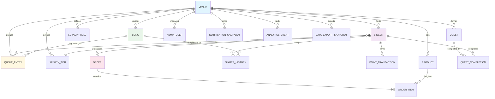

# Scales: Data Models & Schema Design

Version: 1.0 | Date: 2026-05-19
Scope: Karaoke platform — KJ local SQLite, Cloud PostgreSQL, API serialization

---

## 1. Entity Overview

| Domain | Entity | Multi-Tenant | Soft Delete | Sync Direction |
|--------|--------|-------------|-------------|----------------|
| Core | Venue | — | Yes | Cloud-only (root) |
| Core | Singer | venue_id | Yes | Bidirectional (KJ ↔ Cloud) |
| Core | Song | venue_id | Yes | Bidirectional |
| Core | SingerHistory | venue_id | No | Append-only (Cloud) |
| Core | QueueEntry | venue_id | No | KJ-authoritative live |
| Loyalty | LoyaltyTier | venue_id | Yes | Bidirectional |
| Loyalty | LoyaltyRule | venue_id | Yes | Cloud → KJ (push) |
| Loyalty | Quest | venue_id | Yes | Cloud → KJ (push) |
| Loyalty | PointTransaction | venue_id | No | Append-only (Cloud) |
| Merch | Product | venue_id | Yes | Cloud-only |
| Merch | Order | venue_id | No | Cloud-only |
| Admin | AdminUser | venue_id | Yes | Cloud-only |
| Admin | NotificationCampaign | venue_id | Yes | Cloud-only |
| Analytics | AnalyticsEvent | venue_id | No | Append-only (Cloud) |
| Compliance | DataExportSnapshot | venue_id | No | Cloud-only |

---

## 2. Entity-Relationship Diagram (Mermaid)

---

## 3. Entity Definitions

### 3.1 Venue

| Field | Type | Null | Description |
|-------|------|------|-------------|
| id | UUID PK | No | App-generated UUIDv4 |
| name | VARCHAR(255) | No | Venue display name |
| slug | VARCHAR(64) UK | No | URL-friendly identifier |
| branding_config | JSON | Yes | Colors, logo URL, theme |
| subscription_tier | VARCHAR(32) | No | free / basic / pro / enterprise |
| subscription_expiry | TIMESTAMPTZ | Yes | Current subscription end |
| timezone | VARCHAR(64) | No | IANA tz (e.g. America/New_York) |
| is_active | BOOLEAN | No | Soft-enable flag |
| created_at | TIMESTAMPTZ | No | ISO 8601 |
| updated_at | TIMESTAMPTZ | No | ISO 8601 |
| deleted_at | TIMESTAMPTZ | Yes | Soft delete marker |

### 3.2 Singer

| Field | Type | Null | Description |
|-------|------|------|-------------|
| id | UUID PK | No | App-generated UUIDv4 |
| venue_id | UUID FK | No | → Venue.id |
| first_name | VARCHAR(100) | No | |
| last_name | VARCHAR(100) | Yes | |
| stage_name | VARCHAR(100) | Yes | Display name at venue |
| contact_info | JSON | Yes | phone, email, social handles |
| loyalty_points | INTEGER | No | Default 0; denormalized cache |
| tier_id | UUID FK | Yes | → LoyaltyTier.id |
| marketing_consent | BOOLEAN | No | Default false |
| uid | VARCHAR(255) UK | Yes | DragonHost2-Hermes sync UID |
| created_at | TIMESTAMPTZ | No | |
| updated_at | TIMESTAMPTZ | No | |
| deleted_at | TIMESTAMPTZ | Yes | |

### 3.3 Song

| Field | Type | Null | Description |
|-------|------|------|-------------|
| id | UUID PK | No | |
| venue_id | UUID FK | No | |
| uid | VARCHAR(255) UK | Yes | artist-title-key hash for dedup |
| artist | VARCHAR(255) | No | |
| title | VARCHAR(255) | No | |
| genre | VARCHAR(64) | Yes | |
| key | VARCHAR(8) | Yes | Musical key (C, Am, etc.) |
| tempo | INTEGER | Yes | BPM |
| file_path | VARCHAR(512) | Yes | Relative path or CDN URL |
| metadata | JSON | Yes | Duration, tags, credits |
| is_explicit | BOOLEAN | No | Default false |
| created_at | TIMESTAMPTZ | No | |
| updated_at | TIMESTAMPTZ | No | |
| deleted_at | TIMESTAMPTZ | Yes | |

### 3.4 SingerHistory

| Field | Type | Null | Description |
|-------|------|------|-------------|
| id | UUID PK | No | |
| singer_id | UUID FK | No | → Singer.id |
| venue_id | UUID FK | No | → Venue.id |
| song_id | UUID FK | No | → Song.id |
| date_sung | TIMESTAMPTZ | No | |
| times_sung | INTEGER | No | Default 1 |
| created_at | TIMESTAMPTZ | No | |

### 3.5 QueueEntry

| Field | Type | Null | Description |
|-------|------|------|-------------|
| id | UUID PK | No | |
| venue_id | UUID FK | No | |
| singer_id | UUID FK | No | → Singer.id |
| song_id | UUID FK | No | → Song.id |
| status | VARCHAR(16) | No | pending / approved / sung / cancelled |
| priority | INTEGER | No | Default 0; higher = sooner |
| note_to_kj | TEXT | Yes | Special request, dedication |
| pitch | VARCHAR(8) | Yes | Vocal key override |
| tempo | INTEGER | Yes | BPM override |
| created_at | TIMESTAMPTZ | No | |
| updated_at | TIMESTAMPTZ | No | |

> **Live-state rule**: KJ device is authoritative for `status` while a rotation session is active. Cloud accepts KJ state and overwrites its own copy.

### 3.6 LoyaltyTier

| Field | Type | Null | Description |
|-------|------|------|-------------|
| id | UUID PK | No | |
| venue_id | UUID FK | No | |
| name | VARCHAR(64) | No | e.g. "Bronze", "Gold" |
| min_points | INTEGER | No | Threshold to enter tier |
| perks | JSON | Yes | {discount: 0.1, priority_queue: true} |
| created_at | TIMESTAMPTZ | No | |
| updated_at | TIMESTAMPTZ | No | |
| deleted_at | TIMESTAMPTZ | Yes | |

### 3.7 LoyaltyRule

| Field | Type | Null | Description |
|-------|------|------|-------------|
| id | UUID PK | No | |
| venue_id | UUID FK | No | |
| event_type | VARCHAR(32) | No | song_sung / dollar_spent / visit / social_share |
| points_awarded | INTEGER | No | Can be negative (redemption) |
| cooldown_hours | INTEGER | No | Default 0; dedup window |
| metadata | JSON | Yes | {dollar_threshold: 5.00} |
| is_active | BOOLEAN | No | Default true |
| created_at | TIMESTAMPTZ | No | |
| updated_at | TIMESTAMPTZ | No | |

### 3.8 Quest

| Field | Type | Null | Description |
|-------|------|------|-------------|
| id | UUID PK | No | |
| venue_id | UUID FK | No | |
| title | VARCHAR(128) | No | |
| description | TEXT | Yes | |
| reward_points | INTEGER | No | |
| criteria | JSON | No | {songs_in_genre: 3, genre: "Country"} |
| start_date | TIMESTAMPTZ | Yes | |
| end_date | TIMESTAMPTZ | Yes | |
| is_active | BOOLEAN | No | Default true |
| created_at | TIMESTAMPTZ | No | |
| updated_at | TIMESTAMPTZ | No | |
| deleted_at | TIMESTAMPTZ | Yes | |

### 3.9 QuestCompletion

| Field | Type | Null | Description |
|-------|------|------|-------------|
| id | UUID PK | No | |
| quest_id | UUID FK | No | → Quest.id |
| singer_id | UUID FK | No | → Singer.id |
| venue_id | UUID FK | No | |
| completed_at | TIMESTAMPTZ | No | |
| points_awarded | INTEGER | No | Snapshot at completion |
| created_at | TIMESTAMPTZ | No | |

### 3.10 PointTransaction

| Field | Type | Null | Description |
|-------|------|------|-------------|
| id | UUID PK | No | |
| singer_id | UUID FK | No | → Singer.id |
| venue_id | UUID FK | No | |
| amount | INTEGER | No | Positive = earned, negative = redeemed |
| type | VARCHAR(16) | No | earned / redeemed / adjusted |
| source | VARCHAR(64) | No | rule_id, quest_id, manual, refund |
| source_id | UUID FK | Yes | FK to originating rule/quest/order |
| created_at | TIMESTAMPTZ | No | |

> Ledger pattern: rows are immutable. Adjustments create negative `amount` rows.

### 3.11 Product

| Field | Type | Null | Description |
|-------|------|------|-------------|
| id | UUID PK | No | |
| venue_id | UUID FK | No | |
| name | VARCHAR(255) | No | |
| description | TEXT | Yes | |
| price | DECIMAL(10,2) | No | |
| image_url | VARCHAR(512) | Yes | |
| dropshipper_sku | VARCHAR(128) | Yes | |
| stock_status | VARCHAR(16) | No | in_stock / low_stock / out_of_stock |
| is_active | BOOLEAN | No | Default true |
| created_at | TIMESTAMPTZ | No | |
| updated_at | TIMESTAMPTZ | No | |
| deleted_at | TIMESTAMPTZ | Yes | |

### 3.12 Order

| Field | Type | Null | Description |
|-------|------|------|-------------|
| id | UUID PK | No | |
| singer_id | UUID FK | No | → Singer.id |
| venue_id | UUID FK | No | |
| total | DECIMAL(10,2) | No | |
| status | VARCHAR(32) | No | pending / paid / processing / shipped / delivered / cancelled / refunded |
| stripe_payment_intent_id | VARCHAR(128) | Yes | |
| shipping_address | JSON | Yes | {name, line1, city, postal, country} |
| created_at | TIMESTAMPTZ | No | |
| updated_at | TIMESTAMPTZ | No | |

### 3.13 OrderItem

| Field | Type | Null | Description |
|-------|------|------|-------------|
| id | UUID PK | No | |
| order_id | UUID FK | No | → Order.id |
| product_id | UUID FK | No | → Product.id |
| venue_id | UUID FK | No | |
| quantity | INTEGER | No | Default 1 |
| unit_price | DECIMAL(10,2) | No | Snapshot at purchase |
| created_at | TIMESTAMPTZ | No | |

### 3.14 AdminUser

| Field | Type | Null | Description |
|-------|------|------|-------------|
| id | UUID PK | No | |
| venue_id | UUID FK | No | |
| email | VARCHAR(255) | No | |
| password_hash | VARCHAR(255) | No | Argon2id |
| role | VARCHAR(16) | No | owner / manager / kj / bartender |
| permissions | JSON | Yes | Granular overrides beyond role |
| last_login_at | TIMESTAMPTZ | Yes | |
| is_active | BOOLEAN | No | Default true |
| created_at | TIMESTAMPTZ | No | |
| updated_at | TIMESTAMPTZ | No | |
| deleted_at | TIMESTAMPTZ | Yes | |

### 3.15 NotificationCampaign

| Field | Type | Null | Description |
|-------|------|------|-------------|
| id | UUID PK | No | |
| venue_id | UUID FK | No | |
| title | VARCHAR(128) | No | |
| body | TEXT | No | |
| target_audience | JSON | Yes | {tier_ids: [], min_visits: 5} |
| send_time | TIMESTAMPTZ | Yes | Scheduled; NULL = draft |
| status | VARCHAR(16) | No | draft / scheduled / sent / cancelled |
| sent_count | INTEGER | No | Default 0 |
| created_at | TIMESTAMPTZ | No | |
| updated_at | TIMESTAMPTZ | No | |

### 3.16 AnalyticsEvent

| Field | Type | Null | Description |
|-------|------|------|-------------|
| id | UUID PK | No | |
| venue_id | UUID FK | No | |
| event_type | VARCHAR(64) | No | song_requested, song_sung, order_placed, etc. |
| singer_id | UUID FK | Yes | Nullable for anonymous events |
| occurred_at | TIMESTAMPTZ | No | |
| metadata | JSON | Yes | Arbitrary event payload |
| created_at | TIMESTAMPTZ | No | |

### 3.17 DataExportSnapshot

| Field | Type | Null | Description |
|-------|------|------|-------------|
| id | UUID PK | No | |
| venue_id | UUID FK | No | |
| singer_id | UUID FK | Yes | NULL = full venue export |
| export_type | VARCHAR(32) | No | gdpr_export / gdpr_deletion / ccpa_export |
| status | VARCHAR(16) | No | pending / ready / expired |
| file_url | VARCHAR(512) | Yes | Presigned S3/R2 URL |
| expires_at | TIMESTAMPTZ | Yes | |
| created_at | TIMESTAMPTZ | No | |
| completed_at | TIMESTAMPTZ | Yes | |

---

## 4. Relationship Summary

| From | To | Cardinality | Type | Cascade |
|------|-----|-------------|------|---------|
| Venue | Singer | 1:N | FK | Soft delete (app layer) |
| Venue | Song | 1:N | FK | Soft delete |
| Venue | QueueEntry | 1:N | FK | Hard delete after session |
| Venue | LoyaltyTier | 1:N | FK | Soft delete |
| Venue | LoyaltyRule | 1:N | FK | Soft delete |
| Venue | Quest | 1:N | FK | Soft delete |
| Venue | Product | 1:N | FK | Soft delete |
| Venue | AdminUser | 1:N | FK | Soft delete |
| Venue | NotificationCampaign | 1:N | FK | Soft delete |
| Venue | AnalyticsEvent | 1:N | FK | Append-only |
| Singer | SingerHistory | 1:N | FK | Hard delete on singer purge |
| Singer | QueueEntry | 1:N | FK | Hard delete after session |
| Singer | PointTransaction | 1:N | FK | Immutable |
| Singer | Order | 1:N | FK | Soft delete |
| Singer | QuestCompletion | 1:N | FK | Hard delete on singer purge |
| Song | SingerHistory | 1:N | FK | Immutable |
| Song | QueueEntry | 1:N | FK | Hard delete after session |
| LoyaltyTier | Singer | 1:N | FK | NULL on tier delete |
| Quest | QuestCompletion | 1:N | FK | Hard delete on quest delete |
| Product | OrderItem | 1:N | FK | Restrict (prevent delete if ordered) |
| Order | OrderItem | 1:N | FK | Cascade delete |

---

## 5. Design Decisions

### R1. App-layer UUIDs
Primary keys are `TEXT UUIDv4` generated by the application. This eliminates `SERIAL` vs `AUTOINCREMENT` conflicts during SQLite ↔ PostgreSQL sync.

### R2. Timestamps as ISO 8601 TEXT (SQLite) / TIMESTAMPTZ (PG)
Application serializes all timestamps to `YYYY-MM-DDTHH:MM:SSZ`. SQLite stores as `TEXT`; PostgreSQL stores as `TIMESTAMPTZ`. Application is source of truth for clock time.

### R3. Booleans as INTEGER 0/1
Portable across both engines. In PG, treated as `BOOLEAN`; in SQLite as `INTEGER`.

### R4. JSON as TEXT (SQLite) / JSONB (PG upgrade path)
Unstructured columns are `TEXT` containing JSON. PG migrations may upgrade these to `JSONB` later, but application reads/writes uniformly.

### R5. SingerHistory = append-only fact table
`singer_id + song_id + date_sung` forms a natural key. Rows are never updated. On duplicate (same singer + song + date within 1 hour), increment `times_sung`.

### R6. PointTransaction = immutable ledger
Points balance is `SUM(amount)` per singer. No UPDATEs. This gives auditability and simplifies conflict resolution during sync.

### R7. QueueEntry = KJ-authoritative live state
While a rotation session is active, the KJ device owns `status`. Cloud accepts KJ state unconditionally. After session close, cloud can archive.

### R8. Order total is denormalized
`Order.total` is a cache of `SUM(order_items.quantity * order_items.unit_price)`. Source of truth is line items. Recompute on read if needed.

### R9. venue_id on every data table
Every operational table carries `venue_id NOT NULL`. This enables:
- Row-Level Security in PostgreSQL
- Per-venue SQLite dumps for KJ machines
- Simple backup/restore per tenant

### R10. Singer.uid for DragonHost2-Hermes sync
Optional `uid` field on Singer. If present, identifies the same human across venues. Used for profile sync, not for FK constraints.

---

## 6. Index Strategy (PostgreSQL)

| Table | Index | Type | Purpose |
|-------|-------|------|---------|
| Venue | slug | UNIQUE | URL routing |
| Singer | (venue_id, uid) | UNIQUE | Cross-venue dedup |
| Singer | (venue_id, tier_id) | B-tree | Tier membership queries |
| Song | (venue_id, uid) | UNIQUE | Deduplication |
| Song | (venue_id, artist, title) | B-tree | Search/browse |
| QueueEntry | (venue_id, status, priority, created_at) | B-tree | KJ live queue view |
| QueueEntry | (singer_id, created_at) | B-tree | Singer history lookup |
| PointTransaction | (singer_id, created_at) | B-tree | Ledger scan |
| AnalyticsEvent | (venue_id, event_type, occurred_at) | B-tree | Dashboard aggregations |
| AnalyticsEvent | (venue_id, occurred_at) | BRIN | Time-series scan on large tables |
| Order | (venue_id, status, created_at) | B-tree | Order management |
| Order | (stripe_payment_intent_id) | UNIQUE | Idempotency |
