# Scales Karaoke Platform — Database Schema Design

> **Version**: 1.0  
> **Status**: Final  
> **Date**: 2026-05-19  
> **Synthesized from**: t_b3c1b205 (Database Schema) + t_2f76af9d (Commerce Schema)  
> **Scope**: 27 tables covering venues, songs, singers, queue, loyalty, merchandise, analytics, and sync. SQLite local <-> PostgreSQL cloud with PowerSync.

---

## Table Index

| # | Table | Sync | Purpose |
|---|-------|------|---------|
| 1 | `venues` | Bidirectional | Root tenant table — karaoke venue definition |
| 2 | `venue_configs` | Bidirectional | Key/value runtime settings per venue |
| 3 | `songs` | Bidirectional | Song catalog (global + custom) |
| 4 | `song_categories` | Bidirectional | Categorization groups per venue |
| 5 | `song_category_mappings` | Bidirectional | Many-to-many song-category links |
| 6 | `singers` | Bidirectional | Patron/singer profiles per venue |
| 7 | `singer_favorites` | Bidirectional | Singer x Song favorites |
| 8 | `queue_requests` | Bidirectional (KJ-authoritative) | Live song request queue |
| 9 | `rotation_sessions` | Bidirectional | KJ rotation/night definitions |
| 10 | `rotation_entries` | Bidirectional (KJ-authoritative) | Ordered rotation entries |
| 11 | `loyalty_tiers` | Bidirectional | Tier definitions per venue |
| 12 | `loyalty_points` | Cloud-only | Append-only points ledger |
| 13 | `loyalty_quests` | Bidirectional | Quest/challenge definitions |
| 14 | `loyalty_quest_completions` | Bidirectional | Quest completion records |
| 15 | `products` | Cloud-only | Merchandise catalog |
| 16 | `orders` | Cloud-only | Merch + Stripe order records |
| 17 | `order_items` | Cloud-only | Line items per order |
| 18 | `dropshippers` | Cloud-only | Fulfillment provider config |
| 19 | `leaderboards` | Cloud-only | Leaderboard definitions |
| 20 | `leaderboard_entries` | Cloud-only | Per-leaderboard rankings |
| 21 | `consents` | Bidirectional | PrivacyConsent toggles |
| 22 | `share_events` | Cloud-only | Social share audit trail |
| 23 | `analytics_events` | Bidirectional (append-only) | Time-series event stream |
| 24 | `analytics_metrics` | Cloud-only | Materialized aggregates |
| 25 | `exports` | Cloud-only | Background export job tracking |
| 26 | `kj_sessions` | KJ-local-only | Active KJ device tracking |
| 27 | `sync_checkpoints` | KJ-local-only | Bidirectional sync watermark |

---


---

## 1. Design Principles

1. **Portable SQL**: All shared tables use types that exist in both SQLite and PostgreSQL. No `SERIAL`, no `UUID` generation in DB, no `INET`, no `JSONB` in SQLite, no PG-only array types.
2. **App-layer UUIDs**: Primary keys are `TEXT` UUIDv4 generated by the application. This avoids SQLite `AUTOINCREMENT` vs PG `SERIAL` collisions during sync. See `UUID_GENERATION_PATTERN.md` (delivered in t_92626528) for per-platform code patterns.

> **Scope note**: The database schema design principles here apply to all Scales tables, including the commerce/payment tables defined in t_2f76af9d (`schema_payments.sql`). The commerce schema has been updated to use `TEXT PRIMARY KEY` with no DB-side UUID generation, aligning with the portable SQL strategy.
3. **Soft deletes**: Every tenant table has `deleted_at TEXT` (NULL = active). Hard deletes are reserved for GDPR/data-retention jobs.
4. **Tenant isolation**: Every data table carries `venue_id TEXT NOT NULL` with a composite index `(venue_id, ...)`. PG implements row-level security (RLS) on top of this. SQLite filters at the app layer.
5. **Timestamps as ISO 8601 TEXT**: `created_at`, `updated_at`, `deleted_at` are stored as `TEXT` (e.g. `2026-05-19T16:00:00Z`). In PG these map to `TIMESTAMPTZ`; in SQLite they are plain `TEXT`. The application layer is the source of truth for clock time.
6. **Booleans as INTEGER 0/1**: Portable across both engines. In PG they are treated as `BOOLEAN`; in SQLite as `INTEGER`.
7. **JSON as TEXT**: Columns that store unstructured config or metadata are `TEXT` containing JSON. In PG the schema may upgrade these to `JSONB` via migration, but the application reads/writes them uniformly.

---

## 2. Multi-Tenancy Strategy

**Ratified by ADR-004 (2026-05-19):** Single shared schema with Row-Level Security (RLS) enforced via `venue_id` on every operational table. See `ADR-004-multi-tenancy-strategy.md` for full rationale including why schema-per-tenant was evaluated and set aside.

|| Table | `venue_id` | Notes |
||-------|-----------|-------|
|| venues | — | Root tenant table. No `venue_id`. |
|| venues (all below) | `NOT NULL` | Every operational/data table is scoped. |
| songs | `NOT NULL` | Even "global" catalog entries are replicated into each venue (or imported). This keeps the schema uniform and avoids cross-venue FKs. |
| singers | `NOT NULL` | A person singing at multiple venues has one row per venue. |
| queue_requests | `NOT NULL` | Queue is live and per-venue. |
| rotation_sessions | `NOT NULL` | Each venue runs independent rotations. |
| analytics_events | `NOT NULL` | Event stream is partitioned by venue. |
| orders | `NOT NULL` | Merch orders are per-venue. |
| products | `NOT NULL` | Products are per-venue (or templated). |

**Referential Integrity Rule**: Foreign keys must reference rows with the **same** `venue_id`. Enforce this in the application layer; in PG add `CHECK` constraints if desired. In SQLite FK enforcement is optional (`PRAGMA foreign_keys = ON` required).

---

## 3. Sync Classification

| Classification | Direction | Conflict Resolution | Tables |
|----------------|-----------|---------------------|--------|
| **Synced (bidirectional)** | KJ ↔ Cloud | Last-write-wins (LWW) on `updated_at` for config; append-only (no overlap) for events/points; KJ authoritative for live `queue_requests` status while session is active. | `venues`, `venue_configs`, `songs`, `song_categories`, `song_category_mappings`, `singers`, `singer_favorites`, `queue_requests`, `rotation_sessions`, `rotation_entries`, `loyalty_tiers`, `loyalty_quests`, `loyalty_quest_completions`, `consents`, `analytics_events` |
| **Cloud-only** | Cloud → nowhere | N/A | `loyalty_points` (append-only ledger, KJ pushes but never edits; stored in cloud), `products`, `orders`, `order_items`, `dropshippers`, `leaderboards`, `leaderboard_entries`, `share_events`, `analytics_metrics`, `exports` |
| **KJ-local-only** | Local only | N/A | `kj_sessions`, `sync_checkpoints` |

> **Conflict Resolution Detail**
> - **LWW**: Compare `updated_at` (ISO 8601 TEXT). If equal, prefer Cloud. Apply to `venues`, `songs`, `singers`, `song_categories`, `loyalty_tiers`.
> - **Append-only**: Records are never updated, only inserted. Natural key prevents duplicates (e.g. `analytics_events` by PK). Merge by ignoring duplicate PKs.
> - **KJ Authority (live state)**: While a `kj_session` is active, `queue_requests` and `rotation_entries` updates from that device win regardless of timestamp. Cloud accepts KJ state and overwrites its own.
> - **Soft delete**: If either side has `deleted_at` set, the deleted version wins over active updates.

---

## 4. SQLite ↔ PostgreSQL Compatibility

| Concept | SQLite | PostgreSQL | Application Contract |
|---------|--------|------------|---------------------|
| Primary Key | `TEXT` (UUID) | `TEXT` (UUID) | App generates UUIDv4. No `AUTOINCREMENT`/`SERIAL`. |
| Timestamps | `TEXT` | `TIMESTAMPTZ` (preferred) or `TEXT` | App serializes to ISO 8601 (`YYYY-MM-DDTHH:MM:SSZ`). |
| Boolean | `INTEGER` (0/1) | `BOOLEAN` | App writes 0/1; PG driver casts automatically. |
| JSON | `TEXT` | `JSONB` (preferred) or `TEXT` | App serializes to JSON string. |
| Soft Delete | `deleted_at TEXT` | `deleted_at TIMESTAMPTZ` | NULL = active; otherwise deletion timestamp. |
| Indexes | `CREATE INDEX` | `CREATE INDEX` + `CONCURRENTLY` for hot adds | Identical DDL for standard B-tree indexes. |
| Full-text search | `FTS5` (optional) | `tsvector` / `tsrank` | Search is abstracted by application layer; use LIKE in SQLite, PG text search in PG. |
| Enum types | `TEXT` + `CHECK` constraint | Native `ENUM` or `TEXT` + `CHECK` | Use `TEXT` + `CHECK` in SQLite; PG can optionally use `ENUM`. Values are enforced by app first. |
| Transactions | `BEGIN`/`COMMIT` | `BEGIN`/`COMMIT` | Identical. Use optimistic locking (`updated_at` check) for concurrent edits. |

---

## 5. ER Diagram (Mermaid)

```mermaid
erDiagram
    VENUES {
        TEXT id PK
        TEXT name
        TEXT slug UK
        TEXT address
        TEXT phone
        TEXT email
        TEXT timezone
        TEXT locale
        TEXT branding_json
        TEXT subscription_tier
        INTEGER is_active
        TEXT created_at
        TEXT updated_at
        TEXT deleted_at
    }

    VENUE_CONFIGS {
        TEXT id PK
        TEXT venue_id FK
        TEXT config_key UK
        TEXT config_value
        TEXT created_at
        TEXT updated_at
    }

    SONGS {
        TEXT id PK
        TEXT venue_id FK
        TEXT catalog_id
        TEXT title
        TEXT artist
        TEXT album
        TEXT genre
        TEXT language
        INTEGER duration_ms
        TEXT lyrics_url
        TEXT cover_art_url
        INTEGER is_available
        INTEGER is_active
        TEXT meta_json
        TEXT created_at
        TEXT updated_at
        TEXT deleted_at
    }

    SONG_CATEGORIES {
        TEXT id PK
        TEXT venue_id FK
        TEXT name
        INTEGER sort_order
        TEXT color
        TEXT created_at
        TEXT updated_at
        TEXT deleted_at
    }

    SONG_CATEGORY_MAPPINGS {
        TEXT id PK
        TEXT song_id FK
        TEXT category_id FK
        TEXT venue_id FK
        TEXT created_at
    }

    SINGERS {
        TEXT id PK
        TEXT venue_id FK
        TEXT auth_provider
        TEXT auth_provider_id
        TEXT stage_name
        TEXT real_name
        TEXT pronouns
        TEXT email
        TEXT phone
        TEXT notes
        TEXT loyalty_tier_id FK
        INTEGER total_points
        TEXT created_at
        TEXT updated_at
        TEXT deleted_at
    }

    SINGER_FAVORITES {
        TEXT id PK
        TEXT venue_id FK
        TEXT singer_id FK
        TEXT song_id FK
        TEXT created_at
    }

    QUEUE_REQUESTS {
        TEXT id PK
        TEXT venue_id FK
        TEXT singer_id FK
        TEXT song_id FK
        TEXT status
        TEXT notes
        INTEGER rotation_position
        TEXT kj_id
        TEXT requested_at
        TEXT updated_at
        TEXT played_at
        TEXT deleted_at
    }

    ROTATION_SESSIONS {
        TEXT id PK
        TEXT venue_id FK
        TEXT name
        TEXT mode
        TEXT started_at
        TEXT ended_at
        INTEGER is_active
        TEXT created_at
        TEXT updated_at
        TEXT deleted_at
    }

    ROTATION_ENTRIES {
        TEXT id PK
        TEXT rotation_session_id FK
        TEXT singer_id FK
        TEXT queue_request_id FK
        INTEGER position
        REAL weight
        TEXT sang_at
        TEXT created_at
        TEXT updated_at
        TEXT deleted_at
    }

    LOYALTY_TIERS {
        TEXT id PK
        TEXT venue_id FK
        TEXT name
        INTEGER min_points
        REAL multiplier
        TEXT color
        TEXT icon
        INTEGER is_active
        TEXT created_at
        TEXT updated_at
        TEXT deleted_at
    }

    LOYALTY_POINTS {
        TEXT id PK
        TEXT venue_id FK
        TEXT singer_id FK
        INTEGER amount
        TEXT reason
        TEXT reference_type
        TEXT reference_id
        TEXT created_at
    }

    LOYALTY_QUESTS {
        TEXT id PK
        TEXT venue_id FK
        TEXT name
        TEXT description
        TEXT criteria_json
        INTEGER reward_points
        INTEGER is_active
        TEXT created_at
        TEXT updated_at
        TEXT deleted_at
    }

    LOYALTY_QUEST_COMPLETIONS {
        TEXT id PK
        TEXT venue_id FK
        TEXT singer_id FK
        TEXT quest_id FK
        TEXT completed_at
        TEXT created_at
    }

    PRODUCTS {
        TEXT id PK
        TEXT venue_id FK
        TEXT name
        TEXT description
        TEXT sku
        INTEGER price_cents
        TEXT currency
        TEXT image_url
        INTEGER is_active
        INTEGER stock_quantity
        TEXT dropshipper_id FK
        TEXT created_at
        TEXT updated_at
        TEXT deleted_at
    }

    ORDERS {
        TEXT id PK
        TEXT venue_id FK
        TEXT singer_id FK
        TEXT stripe_payment_intent_id UK
        TEXT status
        INTEGER total_cents
        TEXT currency
        TEXT shipping_address_json
        TEXT created_at
        TEXT updated_at
        TEXT deleted_at
    }

    ORDER_ITEMS {
        TEXT id PK
        TEXT order_id FK
        TEXT product_id FK
        INTEGER quantity
        INTEGER unit_price_cents
        TEXT created_at
    }

    DROPSHIPPERS {
        TEXT id PK
        TEXT venue_id FK
        TEXT name
        TEXT api_endpoint
        TEXT auth_config_json
        INTEGER is_active
        TEXT created_at
        TEXT updated_at
        TEXT deleted_at
    }

    LEADERBOARDS {
        TEXT id PK
        TEXT venue_id FK
        TEXT name
        TEXT metric_type
        TEXT period_start
        TEXT period_end
        INTEGER is_active
        TEXT created_at
        TEXT updated_at
        TEXT deleted_at
    }

    LEADERBOARD_ENTRIES {
        TEXT id PK
        TEXT leaderboard_id FK
        TEXT singer_id FK
        REAL score
        INTEGER rank
        TEXT updated_at
    }

    CONSENTS {
        TEXT id PK
        TEXT venue_id FK
        TEXT singer_id FK
        TEXT consent_type
        INTEGER granted
        TEXT granted_at
        TEXT ip_address
        TEXT metadata_json
        TEXT created_at
    }

    SHARE_EVENTS {
        TEXT id PK
        TEXT venue_id FK
        TEXT singer_id FK
        TEXT platform
        TEXT url
        TEXT content_type
        TEXT created_at
    }

    ANALYTICS_EVENTS {
        TEXT id PK
        TEXT venue_id FK
        TEXT event_type
        TEXT singer_id FK
        TEXT song_id FK
        TEXT session_id FK
        TEXT payload_json
        TEXT created_at
    }

    ANALYTICS_METRICS {
        TEXT id PK
        TEXT venue_id FK
        TEXT metric_name
        TEXT dimensions_json
        REAL value
        TEXT bucket_start
        TEXT bucket_end
        TEXT granularity
        TEXT created_at
    }

    EXPORTS {
        TEXT id PK
        TEXT venue_id FK
        TEXT export_type
        TEXT status
        TEXT filter_params_json
        TEXT file_url
        INTEGER file_size
        TEXT created_by
        TEXT created_at
        TEXT completed_at
        TEXT deleted_at
    }

    KJ_SESSIONS {
        TEXT id PK
        TEXT venue_id FK
        TEXT device_id UK
        TEXT device_name
        TEXT started_at
        TEXT last_heartbeat_at
        TEXT current_rotation_session_id FK
        TEXT state_snapshot_json
        TEXT sync_checkpoint_at
        TEXT created_at
        TEXT updated_at
    }

    SYNC_CHECKPOINTS {
        TEXT id PK
        TEXT venue_id FK
        TEXT kj_session_id FK
        TEXT table_name
        TEXT last_synced_at
        TEXT last_record_id
        TEXT checksum
        TEXT direction
        TEXT created_at
        TEXT updated_at
    }

    VENUES ||--o{ VENUE_CONFIGS : "has"
    VENUES ||--o{ SONGS : "owns"
    VENUES ||--o{ SONG_CATEGORIES : "owns"
    VENUES ||--o{ SINGERS : "registers"
    VENUES ||--o{ QUEUE_REQUESTS : "hosts"
    VENUES ||--o{ ROTATION_SESSIONS : "runs"
    VENUES ||--o{ LOYALTY_TIERS : "defines"
    VENUES ||--o{ LOYALTY_QUESTS : "defines"
    VENUES ||--o{ PRODUCTS : "sells"
    VENUES ||--o{ ORDERS : "receives"
    VENUES ||--o{ LEADERBOARDS : "publishes"
    VENUES ||--o{ CONSENTS : "collects"
    VENUES ||--o{ SHARE_EVENTS : "tracks"
    VENUES ||--o{ ANALYTICS_EVENTS : "logs"
    VENUES ||--o{ ANALYTICS_METRICS : "aggregates"
    VENUES ||--o{ EXPORTS : "generates"
    VENUES ||--o{ KJ_SESSIONS : "hosts"

    SONGS ||--o{ SONG_CATEGORY_MAPPINGS : "categorized"
    SONG_CATEGORIES ||--o{ SONG_CATEGORY_MAPPINGS : "groups"
    SONGS ||--o{ QUEUE_REQUESTS : "requested"
    SONGS ||--o{ SINGER_FAVORITES : "favorited"
    SINGERS ||--o{ SINGER_FAVORITES : "marks"
    SINGERS ||--o{ QUEUE_REQUESTS : "requests"
    SINGERS ||--o{ ROTATION_ENTRIES : "performs"
    SINGERS ||--o{ LOYALTY_POINTS : "earns"
    SINGERS ||--o{ LOYALTY_QUEST_COMPLETIONS : "completes"
    SINGERS ||--o{ ORDERS : "places"
    SINGERS ||--o{ LEADERBOARD_ENTRIES : "ranks"
    SINGERS ||--o{ CONSENTS : "grants"
    SINGERS ||--o{ SHARE_EVENTS : "triggers"

    ROTATION_SESSIONS ||--o{ ROTATION_ENTRIES : "contains"
    QUEUE_REQUESTS ||--o{ ROTATION_ENTRIES : "fulfills"
    LOYALTY_TIERS ||--o{ SINGERS : "tiers"
    LOYALTY_QUESTS ||--o{ LOYALTY_QUEST_COMPLETIONS : "completed"
    DROPSHIPPERS ||--o{ PRODUCTS : "fulfills"
    PRODUCTS ||--o{ ORDER_ITEMS : "line_items"
    ORDERS ||--o{ ORDER_ITEMS : "contains"
    LEADERBOARDS ||--o{ LEADERBOARD_ENTRIES : "ranks"
    KJ_SESSIONS ||--o{ SYNC_CHECKPOINTS : "tracks"
```



---

## 6. Table Definitions

### 6.1 Venues

```sql
CREATE TABLE venues (
    id              TEXT PRIMARY KEY,
    name            TEXT NOT NULL,
    slug            TEXT NOT NULL UNIQUE,
    address         TEXT,
    phone           TEXT,
    email           TEXT,
    timezone        TEXT NOT NULL DEFAULT 'UTC',
    locale          TEXT NOT NULL DEFAULT 'en-US',
    branding_json   TEXT NOT NULL DEFAULT '{}',
    subscription_tier TEXT NOT NULL DEFAULT 'free',
    is_active       INTEGER NOT NULL DEFAULT 1,
    created_at      TEXT NOT NULL,
    updated_at      TEXT NOT NULL,
    deleted_at      TEXT
);

CREATE INDEX idx_venues_slug ON venues(slug);
CREATE INDEX idx_venues_active ON venues(is_active);
```

**Sync**: Bidirectional (LWW).  
**Notes**: `subscription_tier` values: `free`, `basic`, `pro`, `enterprise`. `branding_json` holds colors, logos, CSS overrides.

---

### 6.2 Venue Configs

```sql
CREATE TABLE venue_configs (
    id              TEXT PRIMARY KEY,
    venue_id        TEXT NOT NULL,
    config_key      TEXT NOT NULL,
    config_value    TEXT,
    created_at      TEXT NOT NULL,
    updated_at      TEXT NOT NULL,
    UNIQUE(venue_id, config_key)
);

CREATE INDEX idx_venue_configs_venue_id ON venue_configs(venue_id);
```

**Sync**: Bidirectional (LWW).  
**Notes**: Key/value override layer for feature flags and runtime settings.

---

### 6.3 Songs

```sql
CREATE TABLE songs (
    id              TEXT PRIMARY KEY,
    venue_id        TEXT NOT NULL,
    catalog_id      TEXT,               -- optional upstream catalog reference
    title           TEXT NOT NULL,
    artist          TEXT NOT NULL,
    album           TEXT,
    genre           TEXT,
    language        TEXT,
    duration_ms     INTEGER,
    lyrics_url      TEXT,
    cover_art_url   TEXT,
    is_available    INTEGER NOT NULL DEFAULT 1,
    is_active       INTEGER NOT NULL DEFAULT 1,
    meta_json       TEXT NOT NULL DEFAULT '{}',
    created_at      TEXT NOT NULL,
    updated_at      TEXT NOT NULL,
    deleted_at      TEXT
);

CREATE INDEX idx_songs_venue_search ON songs(venue_id, title, artist);
CREATE INDEX idx_songs_venue_available ON songs(venue_id, is_available);
CREATE INDEX idx_songs_venue_catalog ON songs(venue_id, catalog_id);
CREATE INDEX idx_songs_venue_active ON songs(venue_id, is_active);
```

**Sync**: Bidirectional (LWW).  
**Notes**: `catalog_id` links to an external master catalog (e.g. a music publisher). Venue-specific custom songs have a NULL `catalog_id`.

---

### 6.4 Song Categories

```sql
CREATE TABLE song_categories (
    id              TEXT PRIMARY KEY,
    venue_id        TEXT NOT NULL,
    name            TEXT NOT NULL,
    sort_order      INTEGER NOT NULL DEFAULT 0,
    color           TEXT,
    created_at      TEXT NOT NULL,
    updated_at      TEXT NOT NULL,
    deleted_at      TEXT
);

CREATE INDEX idx_song_categories_venue ON song_categories(venue_id);
CREATE INDEX idx_song_categories_venue_order ON song_categories(venue_id, sort_order);
```

**Sync**: Bidirectional (LWW).

---

### 6.5 Song Category Mappings

```sql
CREATE TABLE song_category_mappings (
    id              TEXT PRIMARY KEY,
    song_id         TEXT NOT NULL,
    category_id     TEXT NOT NULL,
    venue_id        TEXT NOT NULL,
    created_at      TEXT NOT NULL,
    UNIQUE(song_id, category_id)
);

CREATE INDEX idx_scm_category ON song_category_mappings(category_id);
CREATE INDEX idx_scm_venue ON song_category_mappings(venue_id);
```

**Sync**: Bidirectional (LWW, treated as insert/delete — updates are rare).  
**Notes**: Junction table. `venue_id` is denormalized for tenant filtering.

---

### 6.6 Singers

```sql
CREATE TABLE singers (
    id              TEXT PRIMARY KEY,
    venue_id        TEXT NOT NULL,
    auth_provider   TEXT,               -- e.g. 'email', 'google', 'apple'
    auth_provider_id TEXT,              -- external identity
    stage_name      TEXT NOT NULL,
    real_name       TEXT,
    pronouns        TEXT,
    email           TEXT,
    phone           TEXT,
    notes           TEXT,
    loyalty_tier_id TEXT,
    total_points    INTEGER NOT NULL DEFAULT 0,
    created_at      TEXT NOT NULL,
    updated_at      TEXT NOT NULL,
    deleted_at      TEXT,
    UNIQUE(venue_id, email) WHERE email IS NOT NULL
);

CREATE INDEX idx_singers_venue_stage ON singers(venue_id, stage_name);
CREATE INDEX idx_singers_venue_auth ON singers(venue_id, auth_provider, auth_provider_id);
CREATE INDEX idx_singers_venue_tier ON singers(venue_id, loyalty_tier_id);
```

**Sync**: Bidirectional (LWW).  
**Notes**: `total_points` is a read-only cache of sum(loyalty_points.amount); computed and updated by triggers or application batch jobs. `auth_provider` + `auth_provider_id` allow linking back to external auth without a global accounts table.

---

### 6.7 Singer Favorites

```sql
CREATE TABLE singer_favorites (
    id              TEXT PRIMARY KEY,
    venue_id        TEXT NOT NULL,
    singer_id       TEXT NOT NULL,
    song_id         TEXT NOT NULL,
    created_at      TEXT NOT NULL,
    UNIQUE(venue_id, singer_id, song_id)
);

CREATE INDEX idx_favorites_singer ON singer_favorites(singer_id);
```

**Sync**: Bidirectional (append-only / merge on duplicate PK).

---

### 6.8 Queue Requests

```sql
CREATE TABLE queue_requests (
    id              TEXT PRIMARY KEY,
    venue_id        TEXT NOT NULL,
    singer_id       TEXT NOT NULL,
    song_id         TEXT NOT NULL,
    status          TEXT NOT NULL DEFAULT 'pending',
    notes           TEXT,
    rotation_position INTEGER,
    kj_id           TEXT,             -- who handled/approved
    requested_at    TEXT NOT NULL,
    updated_at      TEXT NOT NULL,
    played_at       TEXT,
    deleted_at      TEXT,
    CHECK(status IN ('pending', 'approved', 'declined', 'played', 'cancelled'))
);

CREATE INDEX idx_queue_venue_status ON queue_requests(venue_id, status);
CREATE INDEX idx_queue_venue_requested ON queue_requests(venue_id, requested_at);
CREATE INDEX idx_queue_singer ON queue_requests(singer_id);
CREATE INDEX idx_queue_song ON queue_requests(song_id);
```

**Sync**: Bidirectional (KJ-authoritative when active).  
**Notes**: `status` state machine: `pending → approved → played` or `pending → declined/cancelled`. `rotation_position` is ephemeral and reset when the request leaves the queue.

---

### 6.9 Rotation Sessions

```sql
CREATE TABLE rotation_sessions (
    id              TEXT PRIMARY KEY,
    venue_id        TEXT NOT NULL,
    name            TEXT NOT NULL,
    mode            TEXT NOT NULL DEFAULT 'fifo',
    started_at      TEXT NOT NULL,
    ended_at        TEXT,
    is_active       INTEGER NOT NULL DEFAULT 1,
    created_at      TEXT NOT NULL,
    updated_at      TEXT NOT NULL,
    deleted_at      TEXT,
    CHECK(mode IN ('fifo', 'weighted', 'random', 'round_robin'))
);

CREATE INDEX idx_rot_sessions_venue_active ON rotation_sessions(venue_id, is_active);
```

**Sync**: Bidirectional (LWW).  
**Notes**: Only one `is_active = 1` rotation per venue at a time (enforced by application layer or partial unique index in PG).

---

### 6.10 Rotation Entries

```sql
CREATE TABLE rotation_entries (
    id              TEXT PRIMARY KEY,
    rotation_session_id TEXT NOT NULL,
    singer_id       TEXT NOT NULL,
    queue_request_id TEXT,
    position        INTEGER NOT NULL,
    weight          REAL NOT NULL DEFAULT 1.0,
    sang_at         TEXT,
    created_at      TEXT NOT NULL,
    updated_at      TEXT NOT NULL,
    deleted_at      TEXT
);

CREATE INDEX idx_rot_entries_session_pos ON rotation_entries(rotation_session_id, position);
CREATE INDEX idx_rot_entries_singer ON rotation_entries(singer_id);
```

**Sync**: Bidirectional (KJ-authoritative when session is active).  
**Notes**: `weight` is used in `weighted` mode. `position` is 1-based and recalculated on reorder.

---

### 6.11 Loyalty Tiers

```sql
CREATE TABLE loyalty_tiers (
    id              TEXT PRIMARY KEY,
    venue_id        TEXT NOT NULL,
    name            TEXT NOT NULL,
    min_points      INTEGER NOT NULL DEFAULT 0,
    multiplier      REAL NOT NULL DEFAULT 1.0,
    color           TEXT,
    icon            TEXT,
    is_active       INTEGER NOT NULL DEFAULT 1,
    created_at      TEXT NOT NULL,
    updated_at      TEXT NOT NULL,
    deleted_at      TEXT
);

CREATE INDEX idx_loyalty_tiers_venue ON loyalty_tiers(venue_id);
```

**Sync**: Bidirectional (LWW).

---

### 6.12 Loyalty Points

```sql
CREATE TABLE loyalty_points (
    id              TEXT PRIMARY KEY,
    venue_id        TEXT NOT NULL,
    singer_id       TEXT NOT NULL,
    amount          INTEGER NOT NULL,
    reason          TEXT,
    reference_type  TEXT,             -- e.g. 'queue_request', 'quest', 'manual'
    reference_id    TEXT,
    created_at      TEXT NOT NULL
);

CREATE INDEX idx_points_singer ON loyalty_points(singer_id, created_at);
CREATE INDEX idx_points_venue ON loyalty_points(venue_id);
```

**Sync**: Cloud-only (append-only from KJ). KJ generates entries and pushes them up. Cloud is the ledger of record. KJ may cache a local `singers.total_points` but does not sync this table back down.  
**Notes**: Never update or delete rows. Negative `amount` for redemptions.

---

### 6.13 Loyalty Quests

```sql
CREATE TABLE loyalty_quests (
    id              TEXT PRIMARY KEY,
    venue_id        TEXT NOT NULL,
    name            TEXT NOT NULL,
    description     TEXT,
    criteria_json   TEXT NOT NULL DEFAULT '{}',
    reward_points   INTEGER NOT NULL DEFAULT 0,
    is_active       INTEGER NOT NULL DEFAULT 1,
    created_at      TEXT NOT NULL,
    updated_at      TEXT NOT NULL,
    deleted_at      TEXT
);

CREATE INDEX idx_loyalty_quests_venue ON loyalty_quests(venue_id);
```

**Sync**: Bidirectional (LWW).  
**Notes**: `criteria_json` defines quest rules (e.g. `{"songs_sung": 5, "genres": ["rock"]}`).

---

### 6.14 Loyalty Quest Completions

```sql
CREATE TABLE loyalty_quest_completions (
    id              TEXT PRIMARY KEY,
    venue_id        TEXT NOT NULL,
    singer_id       TEXT NOT NULL,
    quest_id        TEXT NOT NULL,
    completed_at    TEXT NOT NULL,
    created_at      TEXT NOT NULL,
    UNIQUE(venue_id, singer_id, quest_id)
);

CREATE INDEX idx_lqc_singer ON loyalty_quest_completions(singer_id);
CREATE INDEX idx_lqc_quest ON loyalty_quest_completions(quest_id);
```

**Sync**: Bidirectional (append-only / merge on duplicate PK).

---

### 6.15 Products

```sql
CREATE TABLE products (
    id              TEXT PRIMARY KEY,
    venue_id        TEXT NOT NULL,
    name            TEXT NOT NULL,
    description     TEXT,
    sku             TEXT,
    price_cents     INTEGER NOT NULL DEFAULT 0,
    currency        TEXT NOT NULL DEFAULT 'USD',
    image_url       TEXT,
    is_active       INTEGER NOT NULL DEFAULT 1,
    stock_quantity  INTEGER,
    dropshipper_id  TEXT,
    created_at      TEXT NOT NULL,
    updated_at      TEXT NOT NULL,
    deleted_at      TEXT
);

CREATE INDEX idx_products_venue ON products(venue_id);
CREATE INDEX idx_products_venue_active ON products(venue_id, is_active);
```

**Sync**: Cloud-only (read-only from KJ if POS is implemented; otherwise not present on KJ).  
**Notes**: `stock_quantity` NULL means not tracked.

---

### 6.16 Orders

```sql
CREATE TABLE orders (
    id              TEXT PRIMARY KEY,
    venue_id        TEXT NOT NULL,
    singer_id       TEXT,
    stripe_payment_intent_id TEXT UNIQUE,
    status          TEXT NOT NULL DEFAULT 'pending',
    total_cents     INTEGER NOT NULL DEFAULT 0,
    currency        TEXT NOT NULL DEFAULT 'USD',
    shipping_address_json TEXT,
    created_at      TEXT NOT NULL,
    updated_at      TEXT NOT NULL,
    deleted_at      TEXT,
    CHECK(status IN ('pending', 'paid', 'fulfilled', 'shipped', 'cancelled', 'refunded'))
);

CREATE INDEX idx_orders_venue_status ON orders(venue_id, status);
CREATE INDEX idx_orders_stripe ON orders(stripe_payment_intent_id);
```

**Sync**: Cloud-only.

---

### 6.17 Order Items

```sql
CREATE TABLE order_items (
    id              TEXT PRIMARY KEY,
    order_id        TEXT NOT NULL,
    product_id      TEXT NOT NULL,
    quantity        INTEGER NOT NULL DEFAULT 1,
    unit_price_cents INTEGER NOT NULL DEFAULT 0,
    created_at      TEXT NOT NULL
);

CREATE INDEX idx_order_items_order ON order_items(order_id);
```

**Sync**: Cloud-only.

---

### 6.18 Dropshippers

```sql
CREATE TABLE dropshippers (
    id              TEXT PRIMARY KEY,
    venue_id        TEXT NOT NULL,
    name            TEXT NOT NULL,
    api_endpoint    TEXT,
    auth_config_json TEXT NOT NULL DEFAULT '{}',
    is_active       INTEGER NOT NULL DEFAULT 1,
    created_at      TEXT NOT NULL,
    updated_at      TEXT NOT NULL,
    deleted_at      TEXT
);

CREATE INDEX idx_dropshippers_venue ON dropshippers(venue_id);
```

**Sync**: Cloud-only.

---

### 6.19 Leaderboards

```sql
CREATE TABLE leaderboards (
    id              TEXT PRIMARY KEY,
    venue_id        TEXT NOT NULL,
    name            TEXT NOT NULL,
    metric_type     TEXT NOT NULL,
    period_start    TEXT,
    period_end      TEXT,
    is_active       INTEGER NOT NULL DEFAULT 1,
    created_at      TEXT NOT NULL,
    updated_at      TEXT NOT NULL,
    deleted_at      TEXT
);

CREATE INDEX idx_leaderboards_venue ON leaderboards(venue_id);
```

**Sync**: Cloud-only (KJ may display read-only cache refreshed on login).  
**Notes**: `metric_type` values: `points`, `songs_sung`, `rotation_streak`, etc.

---

### 6.20 Leaderboard Entries

```sql
CREATE TABLE leaderboard_entries (
    id              TEXT PRIMARY KEY,
    leaderboard_id  TEXT NOT NULL,
    singer_id       TEXT NOT NULL,
    score           REAL NOT NULL DEFAULT 0,
    rank            INTEGER,
    updated_at      TEXT NOT NULL,
    UNIQUE(leaderboard_id, singer_id)
);

CREATE INDEX idx_lb_entries_leaderboard ON leaderboard_entries(leaderboard_id, rank);
```

**Sync**: Cloud-only.

---

### 6.21 Consents

```sql
CREATE TABLE consents (
    id              TEXT PRIMARY KEY,
    venue_id        TEXT NOT NULL,
    singer_id       TEXT NOT NULL,
    consent_type    TEXT NOT NULL,
    granted         INTEGER NOT NULL DEFAULT 0,
    granted_at      TEXT,
    ip_address      TEXT,
    metadata_json   TEXT NOT NULL DEFAULT '{}',
    created_at      TEXT NOT NULL,
    UNIQUE(venue_id, singer_id, consent_type)
);

CREATE INDEX idx_consents_singer ON consents(singer_id);
```

**Sync**: Bidirectional (LWW, but typically append-only; updates only flip `granted`).  
**Notes**: `consent_type` values: `social_share`, `recording`, `photo`, `marketing`.

---

### 6.22 Share Events

```sql
CREATE TABLE share_events (
    id              TEXT PRIMARY KEY,
    venue_id        TEXT NOT NULL,
    singer_id       TEXT NOT NULL,
    platform        TEXT NOT NULL,
    url             TEXT,
    content_type    TEXT,
    created_at      TEXT NOT NULL
);

CREATE INDEX idx_share_events_venue ON share_events(venue_id, created_at);
```

**Sync**: Cloud-only (append-only from KJ / web app).  
**Notes**: Audit trail for viral loop analytics.

---

### 6.23 Analytics Events

```sql
CREATE TABLE analytics_events (
    id              TEXT PRIMARY KEY,
    venue_id        TEXT NOT NULL,
    event_type      TEXT NOT NULL,
    singer_id       TEXT,
    song_id         TEXT,
    session_id      TEXT,
    payload_json    TEXT NOT NULL DEFAULT '{}',
    created_at      TEXT NOT NULL
);

CREATE INDEX idx_analytics_venue_type_time ON analytics_events(venue_id, event_type, created_at);
CREATE INDEX idx_analytics_session ON analytics_events(session_id);
```

**Sync**: Bidirectional (append-only). KJ logs events locally and streams them to cloud. Cloud deduplicates by `id`.  
**Notes**: `event_type` values: `song_played`, `queue_add`, `rotation_advance`, `singer_checkin`, `purchase`, `share`, etc.

---

### 6.24 Analytics Metrics

```sql
CREATE TABLE analytics_metrics (
    id              TEXT PRIMARY KEY,
    venue_id        TEXT NOT NULL,
    metric_name     TEXT NOT NULL,
    dimensions_json TEXT NOT NULL DEFAULT '{}',
    value           REAL NOT NULL DEFAULT 0,
    bucket_start    TEXT NOT NULL,
    bucket_end      TEXT NOT NULL,
    granularity     TEXT NOT NULL DEFAULT 'day',
    created_at      TEXT NOT NULL,
    UNIQUE(venue_id, metric_name, granularity, bucket_start, dimensions_json)
);

CREATE INDEX idx_metrics_venue_name ON analytics_metrics(venue_id, metric_name);
```

**Sync**: Cloud-only (materialized aggregates).  
**Notes**: Populated by batch jobs from `analytics_events`.

---

### 6.25 Exports

```sql
CREATE TABLE exports (
    id              TEXT PRIMARY KEY,
    venue_id        TEXT NOT NULL,
    export_type     TEXT NOT NULL,
    status          TEXT NOT NULL DEFAULT 'queued',
    filter_params_json TEXT NOT NULL DEFAULT '{}',
    file_url        TEXT,
    file_size       INTEGER,
    created_by      TEXT,
    created_at      TEXT NOT NULL,
    completed_at    TEXT,
    deleted_at      TEXT,
    CHECK(status IN ('queued', 'running', 'completed', 'failed', 'cancelled'))
);

CREATE INDEX idx_exports_venue_status ON exports(venue_id, status);
```

**Sync**: Cloud-only.  
**Notes**: Background job table for CSV/Excel/PDF exports.

---

### 6.26 KJ Sessions

```sql
CREATE TABLE kj_sessions (
    id                  TEXT PRIMARY KEY,
    venue_id            TEXT NOT NULL,
    device_id           TEXT NOT NULL UNIQUE,
    device_name         TEXT,
    started_at          TEXT NOT NULL,
    last_heartbeat_at   TEXT NOT NULL,
    current_rotation_session_id TEXT,
    state_snapshot_json TEXT NOT NULL DEFAULT '{}',
    sync_checkpoint_at  TEXT,
    created_at          TEXT NOT NULL,
    updated_at          TEXT NOT NULL
);

CREATE INDEX idx_kj_sessions_venue ON kj_sessions(venue_id);
```

**Sync**: KJ-local-only.  
**Notes**: Tracks the alive state of a KJ device. `device_id` is a stable hardware or install identifier.

---

### 6.27 Sync Checkpoints

```sql
CREATE TABLE sync_checkpoints (
    id              TEXT PRIMARY KEY,
    venue_id        TEXT NOT NULL,
    kj_session_id   TEXT NOT NULL,
    table_name      TEXT NOT NULL,
    last_synced_at  TEXT NOT NULL,
    last_record_id  TEXT,
    checksum        TEXT,
    direction       TEXT NOT NULL,
    created_at      TEXT NOT NULL,
    updated_at      TEXT NOT NULL,
    UNIQUE(venue_id, kj_session_id, table_name, direction)
);

CREATE INDEX idx_sync_cp_session ON sync_checkpoints(kj_session_id);
```

**Sync**: KJ-local-only.  
**Notes**: `direction` values: `up` (KJ → Cloud), `down` (Cloud → KJ). `last_record_id` is the max `id` or `updated_at` watermark for the table. Used by the sync daemon to resume efficiently.

---

## 7. Referential Integrity & Tenant Boundaries

All foreign key relationships in the ER diagram are logically constrained to the same `venue_id`. For example:

- `singers.loyalty_tier_id` must reference a `loyalty_tiers.id` with the same `venue_id`.
- `rotation_entries.rotation_session_id` must reference a `rotation_sessions.id` with the same `venue_id`.

Because SQLite does not enforce composite foreign keys with tenant checks natively, and PG RLS can obscure visibility, the application layer must validate these boundaries before insert/update.

**Recommended PG Enhancement** (not required in SQLite):
```sql
-- Example: ensure a singer cannot link to a tier in another venue
ALTER TABLE singers ADD CONSTRAINT fk_singer_tier_same_venue
    FOREIGN KEY (loyalty_tier_id) REFERENCES loyalty_tiers(id)
    -- Enforced by application; PG FK alone does not guard tenant boundaries.
```

Add a `CHECK` in PG if desired:
```sql
-- Not portable to SQLite, PG-only optimization:
-- CREATE TRIGGER trg_validate_tenant BEFORE INSERT OR UPDATE ON singers ...
```

---

## 8. Index Summary

| Table | Index | Purpose |
|-------|-------|---------|
| venues | `slug` | Lookup by vanity slug |
| songs | `venue_id, title, artist` | Song search |
| songs | `venue_id, is_available` | Available filter |
| songs | `venue_id, catalog_id` | Catalog sync dedup |
| singers | `venue_id, stage_name` | Singer search |
| singers | `venue_id, auth_provider, auth_provider_id` | OAuth linking |
| queue_requests | `venue_id, status` | Active queue view |
| queue_requests | `venue_id, requested_at` | Chronological list |
| rotation_entries | `rotation_session_id, position` | Ordered rotation read |
| loyalty_points | `singer_id, created_at` | Ledger history |
| analytics_events | `venue_id, event_type, created_at` | Analytics slice queries |
| orders | `venue_id, status` | Order management |
| orders | `stripe_payment_intent_id` | Stripe webhook lookup |
| leaderboard_entries | `leaderboard_id, rank` | Top-N leaderboard |
| share_events | `venue_id, created_at` | Recent shares |

---

## 9. Schema Evolution Strategy

1. **Migrations**: Every table change is a numbered migration script (`001_create_songs.sql`, `002_add_song_meta_json.sql`).
2. **PG vs SQLite divergence**: If a column benefits from `JSONB` in PG (e.g. `meta_json`), a separate `*_pg.sql` migration upgrades the PG schema. The application still treats it as `TEXT` on read/write to maintain SQLite compatibility.
3. **Additive-only in hot path**: Avoid `ALTER TABLE DROP COLUMN` on synced tables during active hours. Rename + create new table + backfill is safer for SQLite.
4. **Version manifest**: Maintain a `_schema_version` table in every database (local and cloud) tracking applied migration IDs. Sync logic checks this before starting.

---

## 10. Security & Privacy Notes

- **Encryption at rest**: Use SQLite SQLCipher for KJ devices; PG encryption handled by cloud provider (RDS/TLS).
- **PII isolation**: `singers.email`, `singers.phone`, and `orders.shipping_address_json` are PII. The `deleted_at` soft-delete + a retention job (`gdpr_scrub_singer PII`) should overwrite these fields after export/GDPR request.
- **Consent gating**: `consents` table must be checked before any `share_events` or public `leaderboard_entries` are generated.
- **RLS (PostgreSQL)**: Enable on every tenant table:
  ```sql
  ALTER TABLE songs ENABLE ROW LEVEL SECURITY;
  CREATE POLICY songs_tenant_isolation ON songs USING (venue_id = current_setting('app.current_venue_id')::TEXT);
  ```
