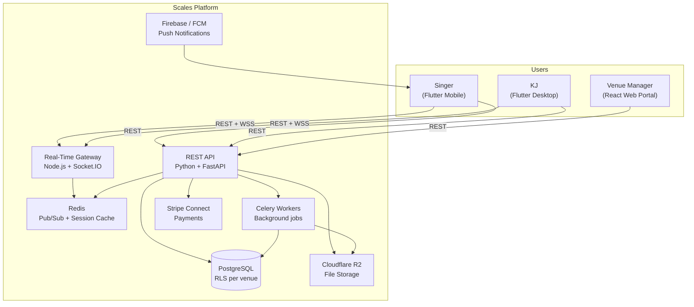
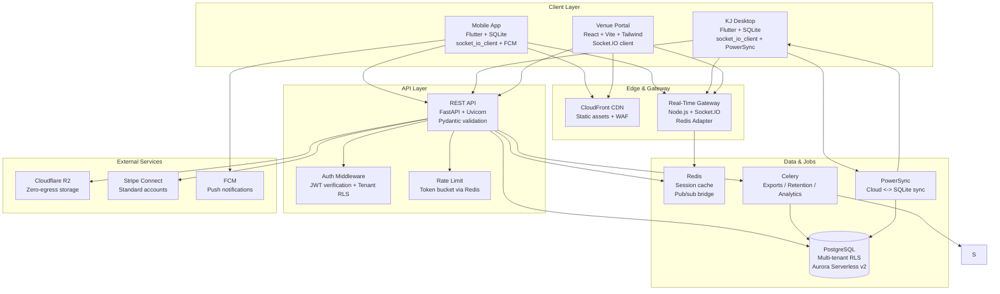
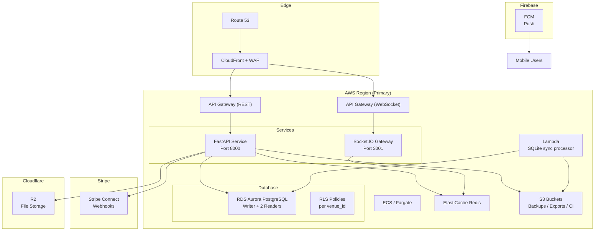

# Scales Karaoke Platform — System Architecture Document

> **Version**: 1.0  
> **Status**: Final  
> **Date**: 2026-05-19  
> **Synthesized from**: Technology Stack Research (t_f9f964d4), API Specification (t_97abe5ff), Portal Architecture (t_16f64d05), Infrastructure Architecture (t_15b21353), Security Architecture (t_47927d77), Database Schema Design (t_b3c1b205), and reconciliation fixes (t_fbe5bf15, t_20644505).

---

## 1. Executive Summary

Scales is a multi-tenant karaoke platform serving three user personas:
- **Singers** — mobile app users who browse song catalogs, join venue queues, earn loyalty points, and interact socially.
- **KJs** — desktop app operators who manage the live queue, rotation, and venue state.
- **Venue Managers** — web dashboard users who configure branding, view analytics, manage merchandise, and administer staff.

The platform is architected as a **hybrid polyglot cloud system**: Python/FastAPI handles REST API business logic, Node.js/Socket.IO powers real-time fan-out, PostgreSQL with Row-Level Security (RLS) stores tenant data in the cloud, SQLite with PowerSync provides local resilience for KJ machines and offline-first mobile, and Flutter delivers cross-platform mobile and desktop clients.

---

## 2. System Context

---

## 3. Component Architecture

---

## 4. Technology Stack Summary

| Layer | Technology | Decision |
|-------|-----------|----------|
| Mobile App | Flutter + PowerSync SDK | Cross-platform; offline-first SQLite with bidirectional sync |
| KJ Desktop | Flutter + SQLite + PowerSync | Same stack as mobile; local resilience, full state restore on crash |
| Venue Portal | React 18 + TypeScript + Vite + Tailwind + Zustand | Lightweight SPA with real-time views |
| REST API | Python + FastAPI + Uvicorn | Auto-generated OpenAPI, Pydantic validation, async ORM |
| Real-Time Gateway | Node.js + Socket.IO + Redis adapter | Proven at 50K+ concurrent connections; room-per-venue |
| Cloud Database | PostgreSQL (RDS Aurora Serverless v2) | JSONB, geospatial, mature RLS for multi-tenancy |
| Local Database | SQLite | Zero-config, portable, instant recovery from disk file |
| Sync Engine | PowerSync | Bidirectional cloud <-> SQLite sync; Flutter-native SDK |
| Cache & Pub/Sub | Redis | Session cache, rate-limit buckets, API-to-gateway broadcast bridge |
| Background Jobs | Celery + Redis | GDPR exports, retention cleanup, analytics aggregation |
| File Storage | Cloudflare R2 | S3-compatible, zero egress fees — critical for avatar/song-art read-heavy pattern |
| Payments | Stripe Connect Standard | Zero POS liability; venues are seller-managed |
| Push Notifications | Firebase Cloud Messaging (FCM) | Free, Flutter-native, topic-based venue messaging |
| CI/CD | GitHub Actions + ECS Blue/Green | See infrastructure document |

The full Technology Stack Recommendation with detailed justifications is in `technology_stack.md`.

---

## 5. Data Flow

### 5.1 Song Request Flow (Singer → KJ)

1. **Singer opens mobile app** → checks in via `POST /venues/{id}/checkin` → receives JWT access token (15 min) + refresh token (7 days).
2. **App connects to Socket.IO gateway** → authenticates with JWT → joins room `venue:{id}`.
3. **Singer browses offline song catalog** → SQLite cache (PowerSync) serves search results; stale data acceptable.
4. **Singer submits request** → `POST /venues/{id}/queue` with `song_id`, `notes`, optional `dedication_to`.
5. **FastAPI validates request** → checks Tier B rate limit (3 req/hour per singer+venue) → inserts `queue_requests` row.
6. **FastAPI publishes event** → Redis `scales:api:broadcasts` with topic `venue:{id}`.
7. **Gateway receives Redis message** → fans out `request.submitted` event to all sockets in `venue:{id}`.
8. **KJ app receives event** → displays new request in UI with approve/reject buttons.
9. **Singer receives confirmation** → `request.approved` (or `request.rejected`) event via same room.

### 5.2 KJ State Broadcast (KJ → All Singers)

1. **KJ starts a song** → clicks "Play" → sends `action.play` WebSocket event to gateway.
2. **Gateway relays** to FastAPI via Redis → FastAPI updates `queue_requests` status to `now_playing`.
3. **FastAPI publishes** `queue.updated` + `song.completed` (for previous song) to Redis.
4. **Gateway fans out** to all clients in `venue:{id}`.
5. **Mobile singers see** updated queue position, estimated wait, and now-playing banner.

### 5.3 KJ Crash Recovery

1. **KJ app runs PowerSync background worker** → syncs SQLite deltas to PostgreSQL every 5 minutes.
2. **On crash** → KJ relaunches → calls `GET /venues/{id}/kj/state` → downloads full venue state snapshot.
3. **KJ app rebuilds local SQLite** → asks operator: "Resume from here?" with 10-second countdown.
4. **Secondary path** → SQLite WAL diffs are checkpointed to S3 every 30 seconds for disaster recovery.

### 5.4 Payment Flow (Merchandise)

1. **Singer adds merch to cart** → `POST /cart` → stored in SQLite (mobile) / session (web).
2. **Checkout** → `POST /checkout` → FastAPI validates cart → creates Stripe Checkout Session.
3. **Client redirects** to Stripe-hosted checkout page.
4. **Stripe webhook** → `checkout.session.completed` → FastAPI creates `orders` + `order_items` rows.
5. **Dropshipper webhook** (if applicable) → fulfillment status updates stored in cloud-only tables.

---

## 6. Deployment Topology

**Scaling Parameters:**
- ECS: 2–50 tasks, scale out at 70% CPU
- Aurora: 0.5–64 ACUs, auto-scale on connections
- Pre-warm Friday 6 PM: 10 ECS tasks + 2 Aurora readers
- Full topology, cost estimates, and DR plan are in `infra_arch.md`.

---

## 7. Security Model

| Domain | Control |
|--------|---------|
| Authentication | Dual-token JWT: 15-minute access + 7-day refresh (single-use, rotated). Device binding. M2M service tokens (30 days). |
| Authorization | RBAC with 4 roles: singer, kj, venue_admin, platform_admin. Venue isolation via PostgreSQL RLS (`venue_id`). |
| Data at Rest | AES-256-GCM (PostgreSQL encrypted storage). SQLite encrypted with SQLCipher. |
| Data in Transit | TLS 1.3 for all HTTP/WSS traffic. Presigned URLs for file uploads. |
| API Security | Two-tier rate limiting (Tier A UX + Tier B abuse-prevention). WAF rules on CloudFront / API Gateway. |
| WebSocket Security | JWT validation on Socket.IO handshake. Per-venue room membership enforced server-side. |
| Compliance | GDPR (EU data residency, RTBF API, 30-day grace period), CCPA (deletion + export), PCI DSS (outsourced to Stripe), COPPA (minor consent management). |
| Secrets | HashiCorp Vault for API keys, Stripe secrets, DB credentials. Automatic rotation. |

The full Security Architecture Review is in `security_architecture.md`.

---

## 8. Multi-Tenancy Architecture

**Decision (ADR-004):** Shared schema + Row-Level Security via `venue_id` on every operational table.

| Approach | Status | Rationale |
|----------|--------|-----------|
| Shared schema + RLS (`venue_id`) | **PRIMARY** | Cost-efficient, single migration path, one PowerSync config, easy cross-tenant analytics |
| Schema-per-tenant | Rejected | Migration complexity, N-schema drift, harder ops |
| DB-per-tenant | Future "Enterprise" tier | True isolation for compliance; +$200–500/mo per tenant |

All tables carry `venue_id TEXT NOT NULL`. Application middleware sets `SET LOCAL app.current_venue_id = '<uuid>'` per request based on JWT `venue_id` claim.

---

## 9. Conflict Resolution Summary

During Phase 1, four cross-task inconsistencies were identified and resolved:

| Blocker | Conflict | Resolution |
|---------|----------|------------|
| B-1 | Portal backend said Node.js/Fastify; Tech Stack said FastAPI | **Resolved**: Hybrid model ratified — FastAPI for REST, Node.js for Socket.IO gateway. Portal stubs updated. |
| B-2 | Portal used raw WebSocket; Tech Stack mandated Socket.IO | **Resolved**: All components upgraded to Socket.IO with Redis adapter, rooms, and fallback chain. |
| B-3 | API spec had 8h/30d token lifetimes; Security had 15min/7d | **Resolved**: All human users use 15-minute access + 7-day refresh. M2M uses 30-day service token. |
| B-4 | API spec had 30 req/min for queue; Security had 3 req/hour | **Resolved**: Two-tier rate limits — Tier A per-minute UX limits + Tier B per-hour abuse-prevention limits. Both apply simultaneously. |

All reconciled values are reflected in this document and its sub-documents.

---

## 10. Document Map

| Document | Contents | Source |
|----------|----------|--------|
| `system_architecture.md` (this file) | Master overview, component diagrams, data flows, conflict resolution | Synthesized |
| `technology_stack.md` | Component-by-component decisions with confidence ratings and justifications | t_f9f964d4 |
| `api_specification.md` | Full OpenAPI-style endpoint inventory, request/response schemas, WebSocket events | t_97abe5ff + t_20644505 reconciliation |
| `database_schema.md` | ER diagram, 27 table DDL definitions, sync classification, index summary | t_b3c1b205 |
| `component_diagrams.md` | Mermaid interaction diagrams: Mobile↔Backend, KJ↔Backend, KJ↔Cloud Sync, Mobile↔KJ | Synthesized |
| `security_architecture.md` | STRIDE threat model, auth architecture, encryption, compliance, incident response | t_47927d77 + t_20644505 reconciliation |
| `infra_arch.md` | AWS topology, scaling, CI/CD, backup/DR, cost estimates | t_15b21353 |
